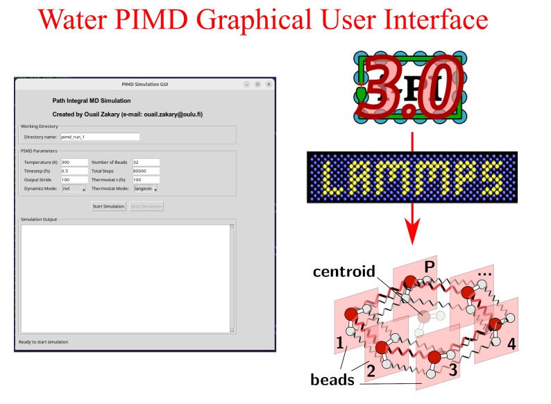

# Water Path Integral Molecular Dynamics (PIMD) Simulation Tool



**Author:** Ouail Zakary  
**ORCID:** [0000-0002-7793-3306](https://orcid.org/0000-0002-7793-3306)  
**E-mail:** [Ouail.Zakary@oulu.fi](mailto:Ouail.Zakary@oulu.fi)  
**Website:** [Ouail Zakary - webpage](https://cc.oulu.fi/~nmrwww/members/Ouail_Zakary.html)  
**Academic Portfolio:** [Ouail Zakary - academic portfolio](https://ozakary.github.io/)

## Course Information
This is `Exercise N°4` from the **Computational Physics and Chemistry 2025** course.

## Prerequisites

### System Requirements
- Python 3.10+
- Tkinter
- Virtual environment support
- Linux (Ubuntu) or macOS
- Jupyter Notebook, for exercise notebooks (version 1.1.1)
- Numpy (version 2.2.4)
- Matplotlib (version 3.10.1)
- Pandas (version 2.2.3)
- Scipy (version 1.15.2)
- Plotly (version 6.0.1)
- Ipykernel (version 6.29.5)
- Pyinstaller (version 6.12.0)
- I-PI (version 2.6.0) [](https://doi.org/10.1063/5.0215869)
- LAMMPS (version 2024.8.29.1.0) [](https://doi.org/10.1016/j.cpc.2021.108171)
- **IMPORTANT!**: Ensure you are **NOT** in a Conda environment (e.g. base, etc.). If in Conda base, deactivate it by writing `conda deactivate` in the terminal

### System Dependencies for Linux
```bash
# Ubuntu/Debian
sudo apt-get update
sudo apt-get install python3-tk python3.12-venv # Replace 3.12 with your current Python version. To check your Python version, run the following command in the terminal: python3 --version.
```
### System Dependencies for MacOS
```bash
# macOS (using Homebrew)
# Install Homebrew if not already installed
/bin/bash -c "$(curl -fsSL https://raw.githubusercontent.com/Homebrew/install/HEAD/install.sh)"

# Install Python and Tkinter
brew install python python-tk
```
### System Dependencies Windows (using WSL - Windows Subsystem for Linux)
```bash
# 1. Install WSL (if not already installed)
wsl --install

# 2. Check if Ubuntu is installed, if not install it
wsl --list
wsl.exe --install Ubuntu

# 3. Open Ubuntu and install dependencies
sudo apt-get update
sudo apt-get install python3-tk python3.12-venv # Replace 3.12 with your current Python version
```

## Installation Instructions

1. Download the Repository
   ```bash
   # Clone or download the repository to your local machine
   git clone https://github.com/ozakary/water-pimd-simulations.git
   ```

2. Navigate to the Source Directory
   ```bash
   cd path/to/repository/src
   ```

3. Install the Application
   ```bash
   # IMPORTANT: Ensure you are NOT in a Conda environment
   # If in Conda base, deactivate it:
   conda deactivate

   # Run the setup script for Linux
   python3 setup_packaging_linux.py

   # Run the setup script for MacOS
   python3 setup_packaging_mac.py
   
   ```

4. Start the Application
   - After successful installation, a `.sh` file will be created in the parent directory
   - Run the application using:
     ```bash
     cd ../
     # Make the `.sh` file executable if it isn't already
     chmod +x run_pimd_simulation.sh

     # Run the file
     ./run_pimd_simulation.sh

     # IMPORTANT: For MacOS users
     # When running the simulations, a window pops up asking for permission to allow the connection. This window is related to socket communication between I-PI and LAMMPS, so the connection should be allowed 
     ```

## Using the PIMD Simulation GUI

1. When the GUI opens, set the working directory name
   - **Important**: This directory will contain all input and output data
   - The directory will be created one level up from the source directory, i.e., the same directory as the `.sh` file

2. Configure Simulation Parameters:
   - Temperature (K)
   - Timestep (fs)
   - Output Stride
   - Number of Beads
   - Total Steps
   - Dynamics Mode
   - Thermostat Mode

3. Click "Start Simulation"

4. After the simulation completes:
   - Manually close the application window
   - Navigate to the working directory to explore the generated data

## Exercise N°4
To begin the exercise:

1. Open the GUI and leave all simulation parameters at their default values, except for `Number of Beads` and `Total Step`, which should be set to `32` and `10000`, respectively. Then, run the PIMD simulation.

2. Open your terminal, navigate to the `exercise_4` directory, and execute the shell script `run_jupyter-notebook.sh`.

```bash
cd path/to/exercice_4

# Make the `.sh` file executable if it isn't already
chmod +x run_jupyter-notebook.sh

./run_jupyter-notebook.sh
```
This will automatically open the jupyter notebook in your default browser. Open `exercice_4_part-1.ipynb` and follow the instructions in the notebook to complete Part 1. To start Part 2, open `exercice_4_part-2.ipynb` and follow the instructions.

## Compatibility
- Tested on Ubuntu Linux
- Support for macOS
- Support for Windows with WSL

## Troubleshooting
- Ensure all system dependencies are installed
- Verify you are not in a **Conda environment**
- Check Python version compatibility

## Citations
**i-PI**: Litman *et al.*, *J. Chem. Phys.* 161, 062504 (**2024**). [](https://doi.org/10.1063/5.0215869)

**LAMMPS**: Thompson *et al.*, *Comput. Phys. Commun.* 271, 108171 (**2022**). [](https://doi.org/10.1016/j.cpc.2021.108171)

---

For further details, please refer to the respective folders or contact the author via the provided email.
