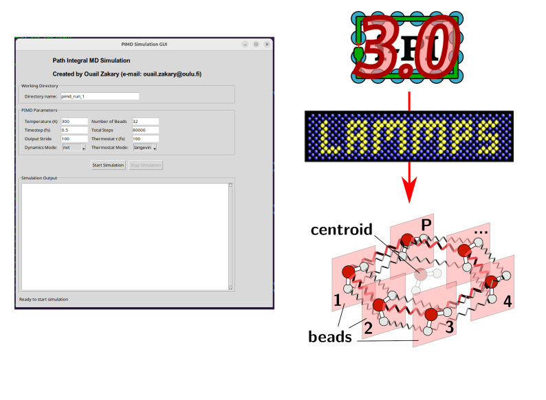

# Water Path Integral Molecular Dynamics (PIMD) Simulation Tool



**Author:** Ouail Zakary  
**ORCID:** [0000-0002-7793-3306](https://orcid.org/0000-0002-7793-3306)  
**E-mail:** [Ouail.Zakary@oulu.fi](mailto:Ouail.Zakary@oulu.fi)  
**Website:** [Ouail Zakary - webpage](https://cc.oulu.fi/~nmrwww/members/Ouail_Zakary.html)	

## Course Information
This is `Exercise N°4` from the **Computational Physics and Chemistry 2025** course.

## Prerequisites

### System Requirements
- Python 3.10+
- Tkinter
- Virtual environment support
- Linux (Ubuntu) or macOS
- Jupyter Notebook (for exercise notebooks)
- Numpy
- Matplotlib
- Pandas
- Scipy
- Plotly
- Ipykernel
- Pyinstaller
- I-PI [](https://doi.org/10.1063/5.0215869)
- LAMMPS [](https://doi.org/10.1016/j.cpc.2021.108171)
- **IMPORTANT!**: Ensure you are **NOT** in a Conda environment (e.g. base, etc.). If in Conda base, deactivate it by writing `conda deactivate` in the terminal

### System Dependencies for Linux
```bash
# Ubuntu/Debian
sudo apt-get update
sudo apt-get install python3-tk python3.12-venv # Replace 3.12 with your current Python version. To check your Python version, run the following command in the terminal: python3 --version.
```
### System Dependencies for MacOS
```bash
# macOS (using Homebrew)
# Install Homebrew if not already installed
/bin/bash -c "$(curl -fsSL https://raw.githubusercontent.com/Homebrew/install/HEAD/install.sh)"

# Install Python and Tkinter
brew install python python-tk
```
## Installation Instructions

1. Download the Repository
   ```bash
   # Clone or download the repository to your local machine
   git clone https://github.com/ozakary/water-pimd-simulations.git
   ```

2. Navigate to the Source Directory
   ```bash
   cd path/to/repository/src
   ```

3. Install the Application
   ```bash
   # IMPORTANT: Ensure you are NOT in a Conda environment
   # If in Conda base, deactivate it:
   conda deactivate

   # Run the setup script for Linux
   python3 setup_packaging_linux.py

   # Run the setup script for MacOS
   python3 setup_packaging_mac.py
   
   ```

4. Start the Application
   - After successful installation, a `.sh` file will be created in the parent directory
   - Run the application using:
     ```bash
     cd ../
     # Make the `.sh` file executable if it isn't already
     chmod +x run_pimd_simulation.sh

     # Run the file
     ./run_pimd_simulation.sh

     # IMPORTANT: For MacOS users
     # When running the simulations, a window pops up asking for permission to allow the connection. This window is related to socket communication between I-PI and LAMMPS, so the connection should be allowed 
     ```

## Using the PIMD Simulation GUI

1. When the GUI opens, set the working directory name
   - **Important**: This directory will contain all input and output data
   - The directory will be created one level up from the source directory, i.e., the same directory as the `.sh` file

2. Configure Simulation Parameters:
   - Temperature (K)
   - Timestep (fs)
   - Output Stride
   - Number of Beads
   - Total Steps
   - Dynamics Mode
   - Thermostat Mode

3. Click "Start Simulation"

4. After the simulation completes:
   - Manually close the application window
   - Navigate to the working directory to explore the generated data

## Exercise N°4
To start working on the exercise, navigate to the exercise_4 directory in your terminal and run the corresponding shell script for each part:

```bash
# For Part 1
cd path/to/exercice_4

# Make the `.sh` file executable if it isn't already
chmod +x part_1.sh

./part_1.sh
```
This will automatically open the jupyter notebook `exercice_4_part-1.ipynb` in your default browser. Follow the instructions in the notebook to complete Part 1.

```bash
# For Part 2

# Make the `.sh` file executable if it isn't already
chmod +x part_2.sh

./part_2.sh
```
This will automatically open the jupyter notebook `exercice_4_part-2.ipynb` (**not available yet**) in your default browser. Follow the instructions in the notebook to complete Part 2.

## Compatibility
- Tested on Ubuntu Linux
- Support for macOS
- Not yet implemented for Windows

## Troubleshooting
- Ensure all system dependencies are installed
- Verify you are not in a **Conda environment**
- Check Python version compatibility

## Citations
**i-PI**: Litman *et al.*, *J. Chem. Phys.* 161, 062504 (**2024**). [](https://doi.org/10.1063/5.0215869)

**LAMMPS**: Thompson *et al.*, *Comput. Phys. Commun.* 271, 108171 (**2022**). [](https://doi.org/10.1016/j.cpc.2021.108171)

---

For further details, please refer to the respective folders or contact the author via the provided email.
